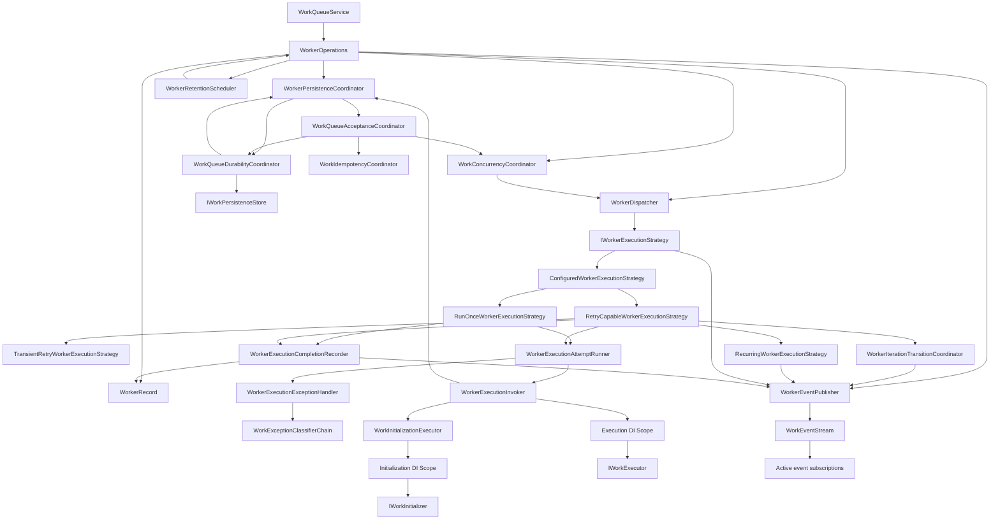
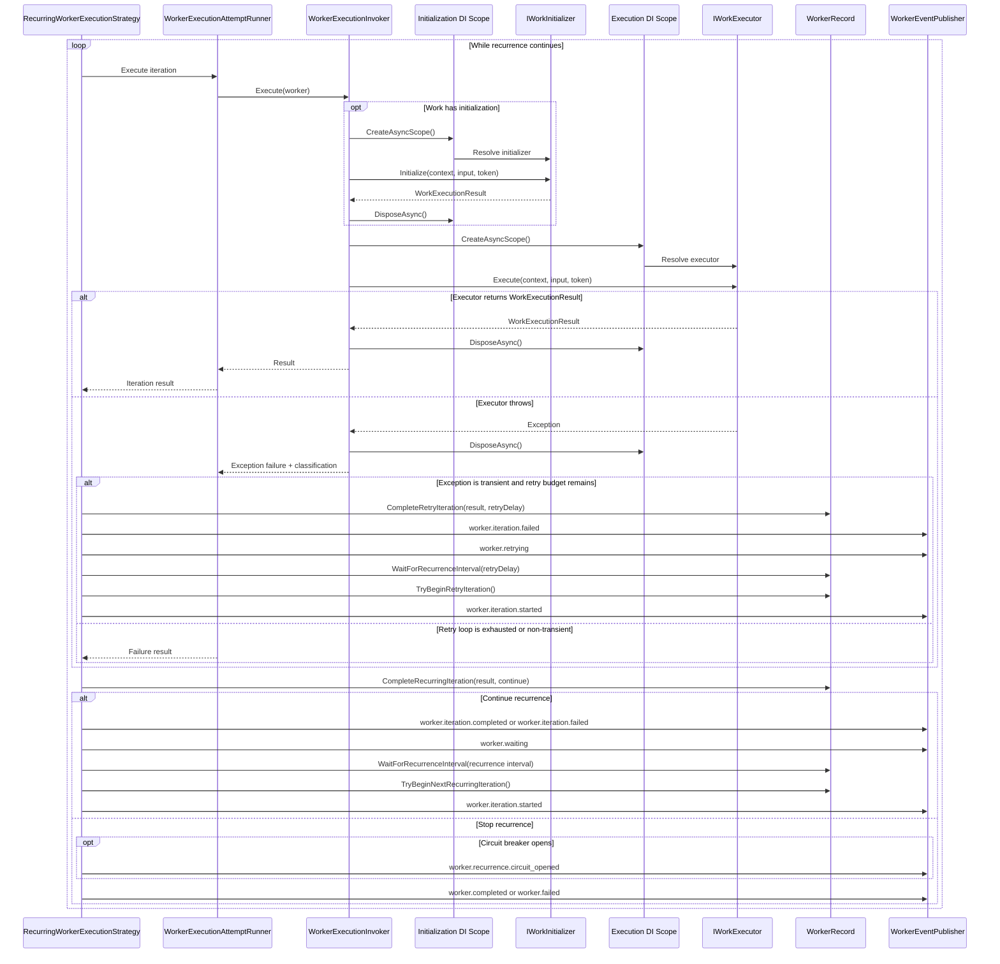
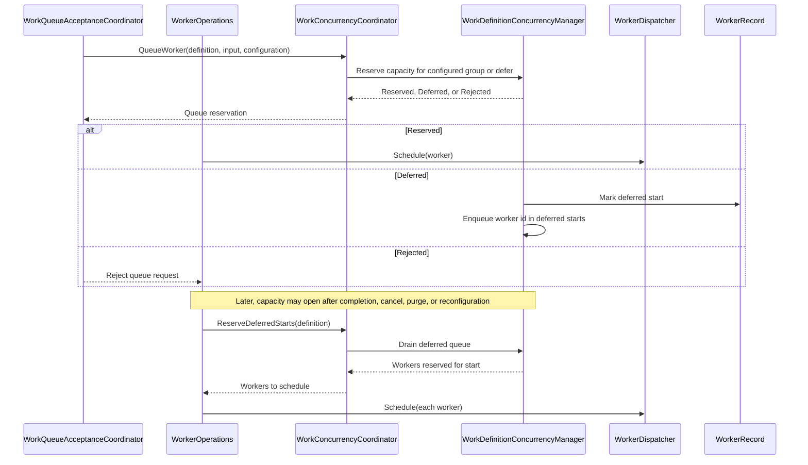
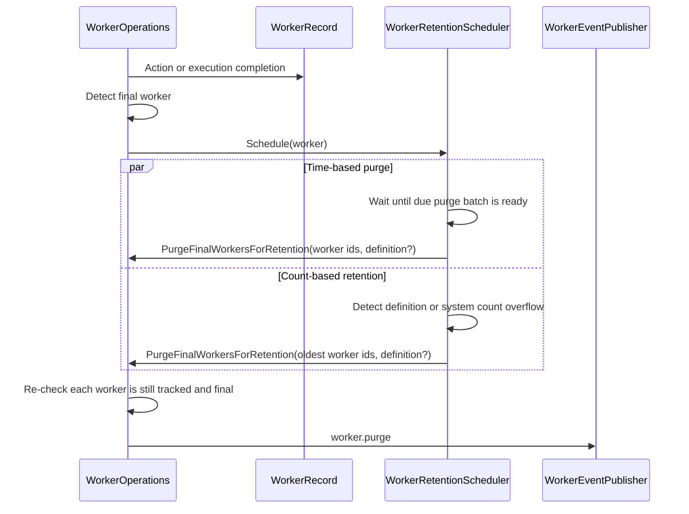

# Execution Engine

The execution engine owns runtime coordination after work is accepted: queue coordination, dispatch, capacity management, durable materialization, worker execution, and automatic retention. The queue acceptance, execution, and handle interaction lifecycle is described in [Work Lifecycle](lifecycle.md).

## Engine Components

`WorkerOperations` is the in-memory owner of worker records. It coordinates worker creation, dispatch, actions, execution completion, concurrency draining, retention scheduling, persistence synchronization, and event publication.

`WorkerPersistenceCoordinator` is the boundary between in-memory workers and coordination features that may use persistence. It centralizes queue acceptance, local and persistent idempotency, durable queue materialization, durable completion, and final-state cleanup.

`WorkQueueAcceptanceCoordinator` prepares a queue request after configuration has been resolved. It validates idempotency inputs, checks local concurrency when needed, decides whether the request can be accepted in memory, and creates durable queue or persistent idempotency requests when persistent coordination is selected.

`WorkIdempotencyCoordinator` handles local duplicate-subject checks against active worker records. Persistent duplicate checks are performed by the durable persistence path so the reservation can be committed atomically with the persisted Workable row.

`WorkQueueDurabilityCoordinator` owns the persistence store integration for durable queueing and persistence-backed idempotency. It initializes and drains persisted rows, writes durable queue entries, signals local materialization, renews leases for active durable workers, detects lost leases, and runs durable cleanup.

`WorkerDispatcher` is the queue-to-execution boundary. It starts accepted workers outside the caller's queue request and caller execution context.

During shutdown, `WorkerOperations` flips the system into a non-accepting state before it interrupts active workers. New queue requests return `WorkQueueStatus.Invalid` with a `workable.system.stopping` message. During normal operation, `WorkerOperations` also checks the system's approximate non-final worker capacity before accepting a new worker. Completed and canceled workers are final, so retained history does not block new queue requests. Shutdown then requests interruption for queued, running, waiting, and retrying workers, stops dispatching, waits for the configured grace period, and force-completes any remaining workers as interrupted in Workable state.

`WorkConcurrencyCoordinator` only participates for workers with concurrency enabled. It owns per-definition managers, so capacity checks and deferred start drains are limited to workers known to that work definition's concurrency manager. Within a definition, capacity can be grouped by definition, subject, or concurrency key.

`WorkerRetentionScheduler` owns automatic purge timing and count-target cleanup for final workers. Final workers are `Completed` and `Canceled`. Scheduled purges and count-retention cleanup both run in batches. Count targets exist at the work definition level and at the system level.

`WorkerEventPublisher` owns canonical worker event names and publication. Queueing, worker actions, execution strategies, and retention all publish worker events through this component.

`WorkEventStream` broadcasts events to matching active subscriptions. Selective subscriptions use bounded per-subscription buffers; unfiltered and broad `DropOldest` subscriptions can share a bounded source-event cursor log to avoid per-subscriber write fanout. Subscriptions are removed when they are disposed or their reader is canceled.

`ConfiguredWorkerExecutionStrategy` chooses the execution path for each worker. Recurring workers use `RecurringWorkerExecutionStrategy`. Non-recurring workers with transient retry `Count` greater than zero use `TransientRetryWorkerExecutionStrategy`; workers with transient retry disabled use `RunOnceWorkerExecutionStrategy`.

`WorkerExecutionAttemptRunner` owns a single execution attempt. Transient retry is orchestrated by the execution strategy so each retry is a separate worker iteration. `WorkerExecutionInvoker` runs configured initializers through `WorkInitializationExecutor`, then resolves and invokes the executor in a separate execution scope. Initializers and the executor do not share scoped service instances. Each initializer run gets its own scope, and each iteration gets a fresh execution scope.

When durable completion is enabled, executor code calls `IWorkExecutionContext.CompleteDurably(...)` with a developer-owned persistence transaction. `WorkerExecutionInvoker` routes that call through `WorkerPersistenceCoordinator` so Workable final cleanup and the caller's business writes can commit or roll back together.

`OnceLazy` initialization uses a per-definition gate. The first worker to reach the initializer runs it while competing workers wait; after it succeeds, later workers skip it. Typed initializers cannot use `OnceLazy` because they depend on worker input.

`RetryCapableWorkerExecutionStrategy` owns the shared attempt loop, transient retry decision logic, retry-delay handling, and execution-resource cleanup used by the retry-capable strategies.

`TransientRetryWorkerExecutionStrategy` now specializes only the terminal behavior for non-recurring work after the shared retry-capable attempt loop finishes. Classification runs work-level classifiers first, then system-level classifiers, then app-wide classifiers. Declarative `WorkExecutionResult.Failure` results are not retried.

`RecurringWorkerExecutionStrategy` keeps one worker alive across repeated iterations. It uses the same shared retry-capable attempt loop, then decides whether that iteration should continue recurrence. After a continued iteration, it records the iteration result, moves the worker to `Waiting`, and waits for the recurrence interval or a `Push` action. Failed iterations can continue, stop immediately, or open the recurrence circuit based on recurrence configuration.

`WorkerExecutionCompletionRecorder` owns the shared tail of execution completion. Declarative failures, successful results, cancellation, shutdown interruption, and final exception failures all flow through it to update the worker record, create the completion, and publish the worker event. For run-once and non-recurring retry workers, it publishes the final iteration event before the terminal completion event.

`WorkerIterationTransitionCoordinator` owns the shared worker and iteration start-event publication for the initial execution start, retry iteration restarts, and next recurring iteration starts.

Recurring workers that opt into concurrency hold their concurrency reservation while waiting between iterations. This keeps one recurring worker from releasing and reacquiring capacity on every interval.

## Recurrence

`Push` signals either the recurrence wait or the retry-delay wait and lets the execution strategy begin the next iteration immediately. `Pause` and `Cancel` also signal those waits so control actions do not wait for the timer to expire.

The first dispatch into active execution still raises `worker.started` as part of `WorkerOperations.Start(...)`. The recurrence strategy raises `worker.iteration.started` for each retry restart and for each later recurring iteration start so iteration timelines stay precise without overloading `worker.started`.

## Concurrency Drain

The concurrency manager does not scan all system workers. Each `WorkDefinitionConcurrencyManager` tracks only the workers that belong to its work definition and participate in concurrency. Deferred draining checks the manager's deferred queue and reserves workers whose configured group has capacity, so a blocked subject or concurrency key does not prevent an unrelated group from starting. The same per-definition manager is also used when persisted workers are materialized back into memory.

## Retention

Retention re-checks each worker before purging. If a scheduled worker was already purged or is no longer final, that entry is ignored. Count-based retention runs in the background and purges the oldest final workers when a definition or the system is above its `MaximumFinalWorkers` target. Purge events are published in batches grouped by work definition when possible.

System-stop cancellation flows through the same accepted worker change path. If a queued or paused worker becomes `Canceled` during stop, retention scheduling is still applied.
