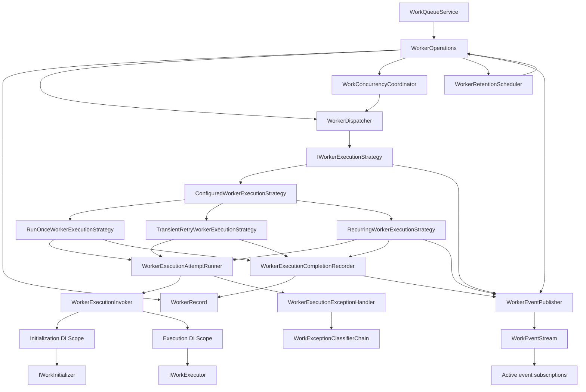
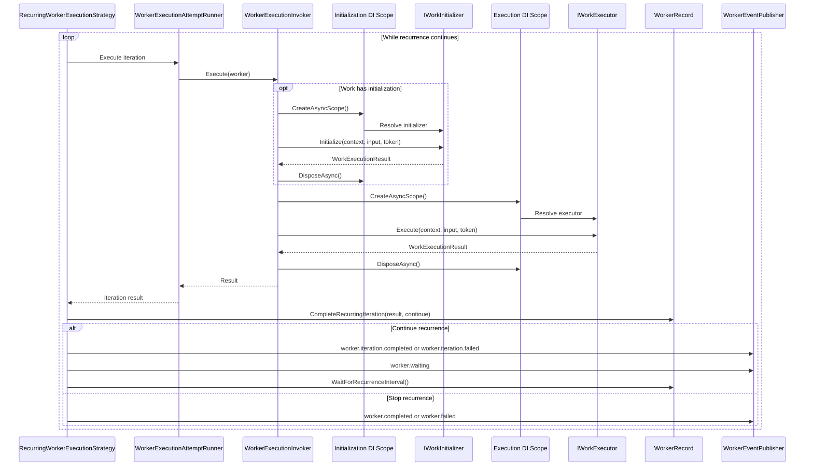
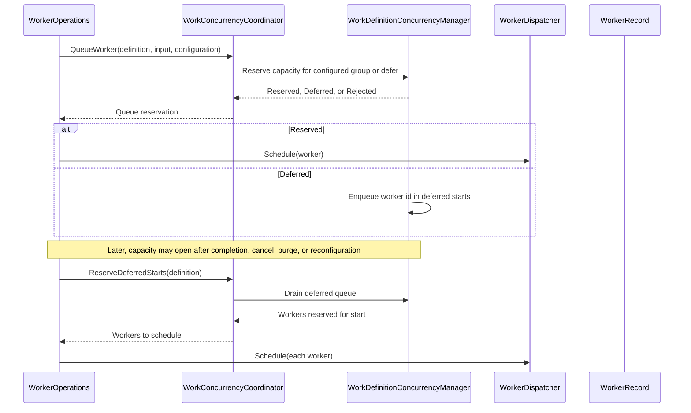
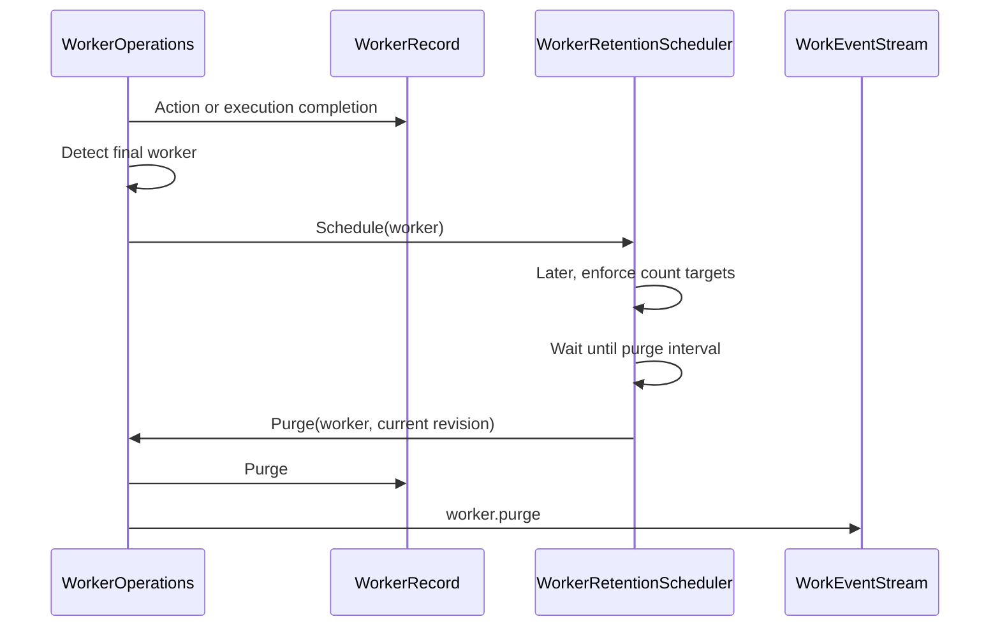

# Execution Engine

The execution engine owns runtime coordination after work is accepted: dispatch, capacity management, worker execution, and automatic retention. The queue acceptance, execution, and handle interaction lifecycle is described in [Work Lifecycle](work-lifecycle.md).

## Engine Components

`WorkerOperations` is the in-memory owner of worker records. It coordinates worker creation, dispatch, actions, execution completion, concurrency draining, retention scheduling, and event publication.

`WorkerDispatcher` is the queue-to-execution boundary. It starts accepted workers outside the caller's queue request and caller execution context.

During shutdown, `WorkerOperations` flips the system into a non-accepting state before it cancels active workers. New queue requests return `WorkQueueStatus.Invalid` with a `workable.system.stopping` message. During normal operation, `WorkerOperations` also checks the system's approximate non-final worker capacity before accepting a new worker. Completed and canceled workers are final, so retained history does not block new queue requests. Shutdown then stops dispatching, requests cancellation for non-final workers, waits for the configured grace period, and force-completes any remaining workers as canceled in Workable state.

`WorkConcurrencyCoordinator` only participates for workers with concurrency enabled. It owns per-definition managers, so capacity checks and deferred start drains are limited to workers known to that work definition's concurrency manager. Within a definition, capacity can be grouped by definition, subject, or concurrency key.

`WorkerRetentionScheduler` owns automatic purge timing and count-target cleanup for final workers. Final workers are `Completed` and `Canceled`. Count targets exist at the work definition level and at the system level.

`WorkerEventPublisher` owns canonical worker event names and publication. Queueing, worker actions, execution strategies, and retention all publish worker events through this component.

`WorkEventStream` broadcasts events to matching active subscriptions. Each subscription owns its own bounded buffer and is removed when the subscription is disposed or its reader is canceled.

`ConfiguredWorkerExecutionStrategy` chooses the execution path for each worker. Recurring workers use `RecurringWorkerExecutionStrategy`. Non-recurring workers with transient retry `Count` greater than zero use `TransientRetryWorkerExecutionStrategy`; workers with transient retry disabled use `RunOnceWorkerExecutionStrategy`.

`WorkerExecutionAttemptRunner` owns a single execution attempt. Transient retry is orchestrated by the execution strategy so each retry is a separate worker iteration. `WorkerExecutionInvoker` runs configured initializers in initialization scopes, then resolves and invokes the executor in a separate execution scope. Initializers and the executor do not share scoped service instances. Each iteration therefore gets new initialization and execution scoped service providers.

`OnceLazy` initialization uses a per-definition gate. The first worker to reach the initializer runs it while competing workers wait; after it succeeds, later workers skip it. Typed initializers cannot use `OnceLazy` because they depend on worker input.

`TransientRetryWorkerExecutionStrategy` retries unhandled execution exceptions that are classified as transient. Classification runs work-level classifiers first, then system-level classifiers, then app-wide classifiers. Declarative `WorkExecutionResult.Failure` results are not retried.

`RecurringWorkerExecutionStrategy` keeps one worker alive across repeated iterations. After a continued iteration, it records the iteration result, moves the worker to `Waiting`, and waits for the recurrence interval or a `Push` action. Failed iterations can continue, stop immediately, or open the recurrence circuit based on recurrence configuration.

`WorkerExecutionCompletionRecorder` owns the shared tail of execution completion. Declarative failures, successful results, cancellation, and final exception failures all flow through it to update the worker record, create the completion, and publish the worker event.

Recurring workers that opt into concurrency hold their concurrency reservation while waiting between iterations. This keeps one recurring worker from releasing and reacquiring capacity on every interval.

## Recurrence

`Push` signals the recurrence wait and moves the worker back through the queued/start path for the next iteration. `Pause` and `Cancel` also signal the wait so control actions do not wait for the recurrence interval to expire.

## Concurrency Drain

The concurrency manager does not scan all system workers. Each `WorkDefinitionConcurrencyManager` tracks only the workers that belong to its work definition and participate in concurrency. Deferred draining checks the manager's deferred queue and reserves workers whose configured group has capacity, so a blocked subject or concurrency key does not prevent an unrelated group from starting.

## Retention

Retention re-checks the worker before purging. If the worker was already purged or is no longer final, the scheduled purge is ignored. Count-based retention runs in the background and purges final workers when a definition or system is above its `MaximumFinalWorkers` target.

System-stop cancellation flows through the same accepted worker change path. If a queued or paused worker becomes `Canceled` during stop, retention scheduling is still applied.
