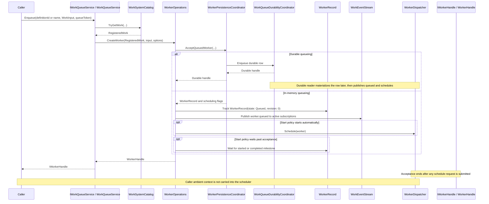
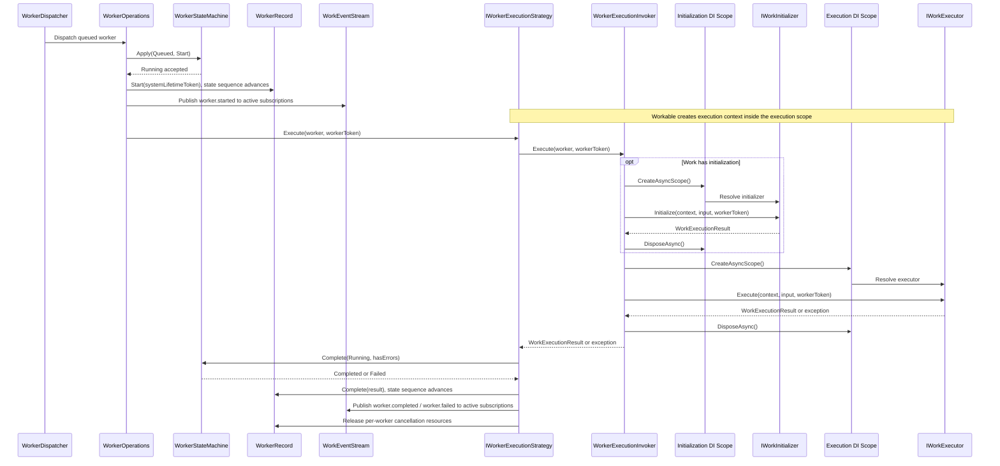
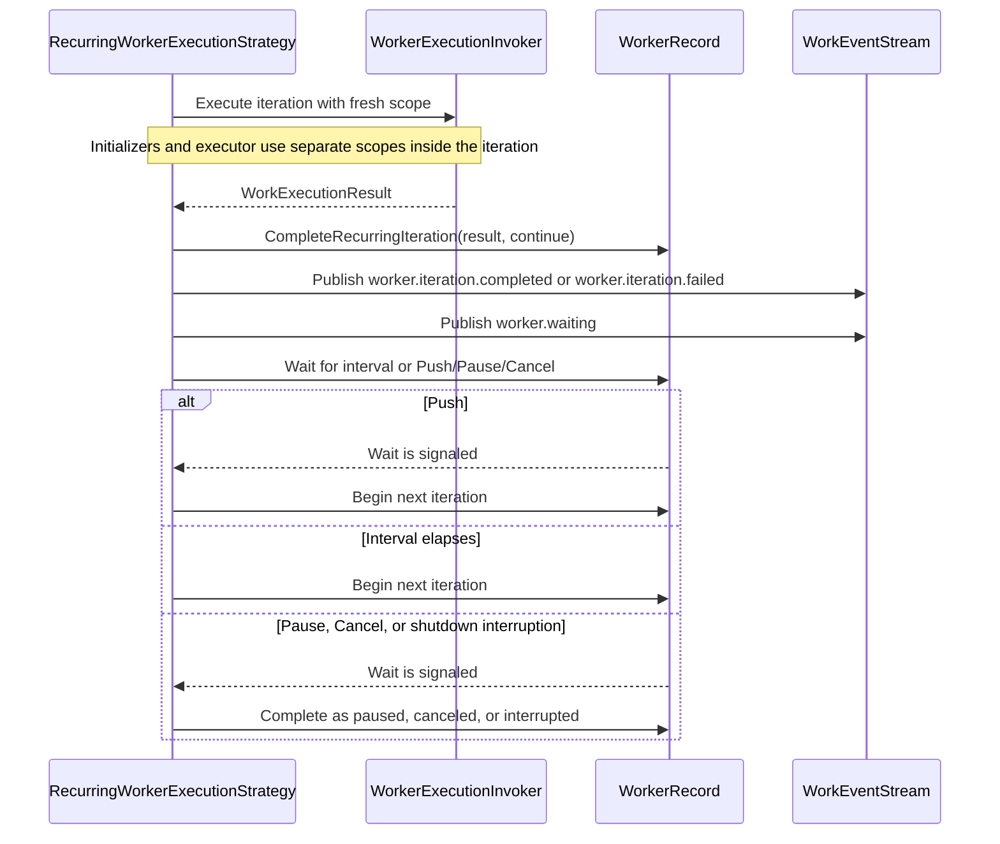
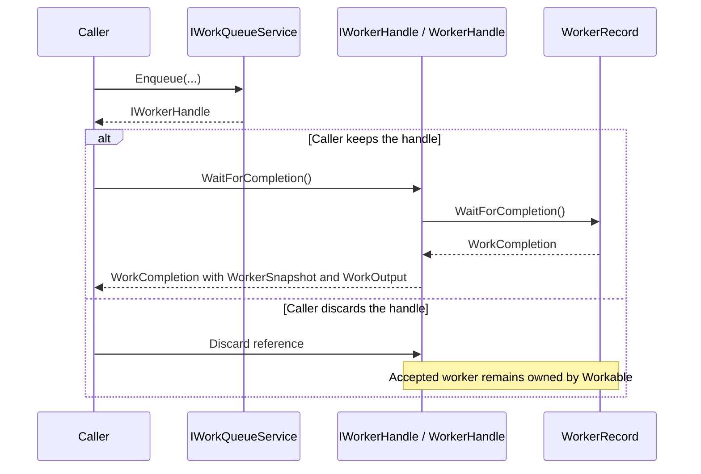
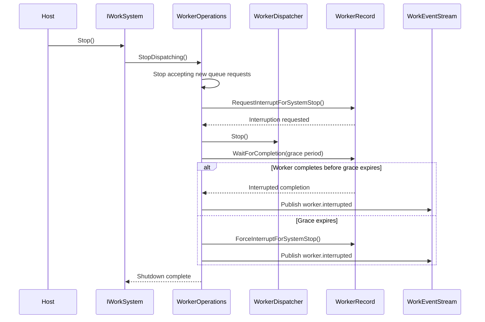

# Work Lifecycle

## Overview

Work begins when a caller queues a known work definition. The queue resolves the definition, creates a worker, and returns a handle according to the worker's start policy. After acceptance, the worker belongs to the Workable system; the caller may keep the handle, await it later, or discard it.

The queue cancellation token applies only to accepting the queue request. Execution uses Workable's system lifetime and per-worker cancellation, so caller-scoped cancellation, for example from a controller action, does not cancel already accepted work.

These diagrams show the normal run-once path in smaller parts. The execution engine also includes dispatch, idempotency, concurrency, durability, and retention coordinators; those are described in [Execution Engine](execution-engine.md).

## Queue Acceptance

Queue acceptance resolves work, validates the effective runtime configuration, and applies coordination before returning to the caller. Non-durable acceptance creates a queued worker record, publishes the queued event, submits a scheduling request when the start policy starts work automatically, and returns according to the configured start policy. Durable acceptance persists the queue entry first; the durable reader publishes the queued event and schedules the worker when the persisted row materializes in memory.

## Execution

Execution begins after dispatch. The dispatcher asks `WorkerOperations` to start the queued worker, then the selected execution strategy invokes work through `WorkerExecutionInvoker`.

Executors receive a Workable-owned `CancellationToken`. Explicit API cancellation and interruption both cancel that token, but they produce different lifecycle outcomes. During interruption, `IWorkExecutionContext.IsInterrupted` returns `true` and `IWorkExecutionContext.InterruptionReason` reports why, such as `Shutdown` or `LeaseLost`, so executor code can distinguish recoverable interruption from an explicit cancel request.

## Recurring Execution

Recurring execution keeps one worker active across multiple iterations. Each iteration calls `WorkerExecutionInvoker`, so every iteration gets its own async DI scope and scoped service provider.

## Worker Handle

The handle exposes the immediate queue outcome and can await completion. The worker continues independently even if the caller discards the handle.

## Shutdown

When a system stops, it stops accepting new queue requests, interrupts queued, running, waiting, and retrying workers, stops the dispatcher, and waits for the shutdown grace period. By default, hosted systems derive that grace period from the .NET generic host shutdown timeout; outside a host, the fallback is 15 seconds. If a worker does not complete after interruption within that allowance, Workable marks the worker as interrupted with a forced-interruption message and continues shutdown. Stop results include the grace period plus summaries and names for workers that had to be force-completed during shutdown. Once shutdown work is complete, Workable clears in-memory worker and iteration records for the system.

Shutdown interruption is not the same as API cancellation. `WorkAction.Cancel` is an explicit final state and publishes the normal cancel/canceled action and completion events. Shutdown interruption records `WorkerState.Interrupted`, publishes `worker.interrupted`, and leaves durable queue rows eligible for replay after lease expiry.

## Classes

- `IWorkQueueService` accepts work by `WorkDefinitionId` or name.
- `WorkQueueService` resolves queued work and delegates worker creation.
- `WorkSystemCatalog` stores the system's immutable work definitions.
- `RegisteredWork` connects a `WorkDefinition` to an executor factory.
- `WorkerOperations` creates workers, owns in-memory dispatch, and applies worker actions.
- `WorkerPersistenceCoordinator` centralizes in-memory and persistence-backed coordination for queue acceptance, durable materialization, durable completion, idempotency lookup, and final-state cleanup.
- `WorkQueueAcceptanceCoordinator` prepares queue acceptance by applying idempotency, concurrency, and durability decisions to the resolved runtime plan.
- `WorkIdempotencyCoordinator` performs local duplicate-subject checks and active subject lookup.
- `WorkQueueDurabilityCoordinator` integrates with the persistence store for durable queue entries, lease renewal, replay, and cleanup.
- `WorkerDispatcher` schedules accepted workers for execution outside the caller's queue request.
- `WorkConcurrencyCoordinator` manages per-definition concurrency managers for work that opts into concurrency.
- `WorkerRetentionScheduler` schedules automatic purge for completed and canceled workers.
- `WorkerRecord` stores worker state, control revision, state sequence, input, output, options, and messages.
- `WorkerIterationSnapshot` reports retained iteration history on `WorkerSnapshot`, including run-once work and transient retry attempts.
- `IWorkerExecutionStrategy` executes a worker according to a runtime strategy.
- `ConfiguredWorkerExecutionStrategy` chooses run-once, transient retry, or recurring execution for each worker.
- `RunOnceWorkerExecutionStrategy` executes workers that run once and then complete.
- `TransientRetryWorkerExecutionStrategy` retries unhandled execution exceptions that are classified as transient.
- `RecurringWorkerExecutionStrategy` executes recurring workers across repeated iterations.
- `WorkerExecutionInvoker` creates initialization scopes for configured initializers, then creates a separate execution scope for the executor.
- `IWorkInitializer` runs setup or validation before executor invocation.
- `WorkerStateMachine` owns action and completion transition rules.
- `IWorkExecutor` runs the work implementation.
- `IWorkExecutionContext` provides execution metadata and scoped services from a Workable-owned execution scope.
- `WorkEventStream` manages active event subscriptions and publishes worker lifecycle events to matching subscribers.
- `WorkerHandle` exposes immediate queue outcome and awaitable completion.
- `WorkCompletion` reports final status, worker snapshot, messages, and output.

## Ownership Rules

- Accepted workers continue running even when the caller discards the `WorkerHandle`.
- The queue cancellation token only cancels queue acceptance before a worker is accepted.
- The dispatcher starts accepted workers outside the caller's execution context.
- Work execution uses Workable-owned cancellation, including pause, cancel, shutdown interruption, and runtime policy cancellation.
- Shutdown stops accepting new queue requests before interruption begins. New queue requests return `WorkQueueStatus.Invalid` with `workable.system.stopping`.
- Shutdown interruption is cooperative. Workable cancels execution tokens, exposes `IWorkExecutionContext.IsInterrupted`, and waits for the configured grace period. Remaining workers are force-completed as interrupted in Workable state.
- Initializers and executors do not share scoped service instances. Each initializer run creates and disposes its own DI scope before the executor scope is created.
- Recurring workers create new initializer and executor scopes for each iteration.
- `OnceLazy` initialization uses a per-definition gate. The first worker that reaches the initializer runs it while competing workers wait; after it succeeds, later workers skip it.
- Recurring workers that use concurrency hold their capacity while waiting between iterations.
- Per-worker execution resources are released when execution completes, fails, pauses, is canceled, or is interrupted.
- Event subscriptions are owned by callers and are removed when disposed or canceled.
